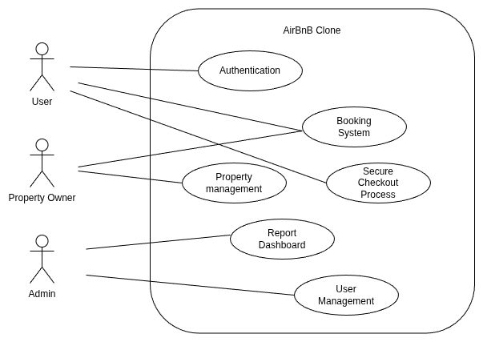

# Requirement Analysis in Software Development

The **Requirement Analysis Project** focuses on crafting a comprehensive foundation for software development by documenting, analyzing, and structuring requirements.

## What is Requirement Analysis?

Requirement analysis is part of the Software Development Life Cycle which involves gathering, analysis and definition of stakeholder requirements for a software product or application to be made. It is 
a very essential process that allows clear scope definition, the ability to create clarity between product team and stakeholders, and serves as the base guideline for technical teams.

## Why is Requirement Analysis Important?

Requirement analysis have the following benefits:

- **Scope Definition**: the ability to define what the product or system is and is not capable of doing.
- **Clarity**: the ability to have clear understanding between product team and stakeholders.
- **Foundation for Technical Team**: the requirement analysis will act as a basis for the product, software development and quality assurance teams.
- **Creating Clear Action Plan**: it will help in creating a clear action plan to execute the project with well defined resources, costs and time estimation.

## Key Activities in Requirement Analysis

- ### Requirement Gathering

This is the initial step where raw requirements are collected from various stakeholders, including clients, and users. 
The goal is to understand the business needs and objectives. It involves meetings, interviews, surveys, workshops and reviewing existing documentation to capture all relevant inputs.

- ### Requirement Elicitation

This involves actively engaging stakeholders to uncover hidden, implicit, or unclear requirements. 
It ensures all necessary information is surfaced, especially for complex systems where stakeholders may not fully articulate their needs upfront.
The following techniques are usually used for requirement elicitation: brainstorming, workshops, use cases, focus groups and prototyping.\

- ### Requirement Documentation

In this stage, the requirements are documented in a clear, structured, and standardized format. 
This could take the form of Software Requirement Specification (SRS) documents, user stories, or use cases. 
Proper documentation ensures a shared understanding among all stakeholders and serves as a reference throughout the project lifecycle.

- ### Requirement Analysis and Modeling

In this stage, the documented requirements are analyzed for feasibility, consistency, completeness, and correctness. 
Modeling tools like data flow diagrams, entity-relationship diagrams, or UML diagrams may be used to visualize and refine the requirements. 
This helps identify potential issues early and supports system design.

- ### Requirement Validation

The final step ensures that the documented and analyzed requirements accurately reflect the stakeholders’ needs. 
Validation involves reviews, definition of acceptance criteria, walkthroughs, or prototype demonstrations to confirm that the requirements are correct, complete, traceable, and agreed upon. 
This step minimizes the risk of rework and misalignment later in the project.

## Types of Requirements

### Functional Requirements

Functional requirements describe what the system should do.

*Examples*:

- **User Authentication**: The system should have a secure login and signup process for users.
- **Property Listings**: The system should display properties with essential details and images.
- **Booking System**: The system should enable users to book properties, view booking details, and manage their bookings.

### Non-functional Requirements

Non-functional requirements describe how the system should perform.

*Examples*:

- **Performance**: The system should load pages within 2 seconds and handle up to 1000 concurrent users.
- **Scalability**: The system should be able to scale horizontally to handle increased traffic.
- **Usability**: The application should have an intuitive UI/UX, making it easy for users to navigate and perform tasks.
- **Reliability**: The system should have an uptime of 99.9999%.

### Use Case Diagrams

Use case diagrams show how different users (actors) interact with the system to achieve specific goals (use cases).

Benefits of Use Case Diagrams:

- Provide a clear visual representation of system functionalities.
- Help in identifying and organizing system requirements.
- Facilitate communication among stakeholders and development team.

*Example*:

### Acceptance Criteria

Acceptance criteria are conditions that a feature must meet to be accepted by the stakeholders. It should be specific and measureable.

Benefits of Acceptance Criteria:

- Ensure all parties have a clear understanding of feature requirements.
- Provide a basis for testing and validation for the quality assurance team.

*Example*: “Users should be able to select available dates, confirm booking, and receive a confirmation email within 2 minutes.”
